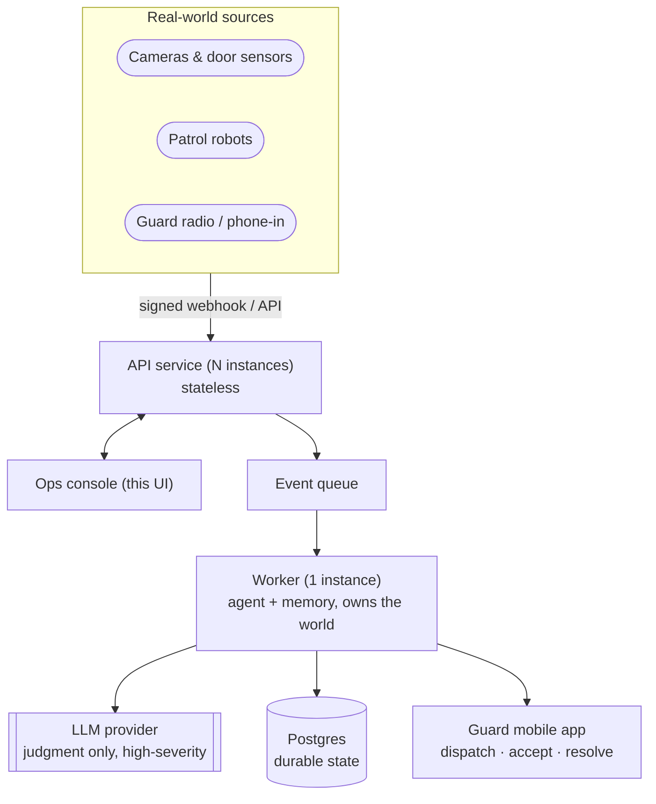

# Guard[ai]n

**An AI dispatch agent for physical security operations.**
Watches the event stream, reasons about it, dispatches, and gets measurably better.

**Live:** [guardian-2hk2.onrender.com](https://guardian-2hk2.onrender.com/)

---

## Quick start

```bash
npm install
cp .env.example .env      # optional, see .env.example for what each key does
npm run dev
```

### Deploy your own

`npm run build && npm start` serves the API and the built console from one
process, and runs entirely in memory with no `DATABASE_URL` set, so a single
free Node web service is enough. On [Render](https://render.com): **New +**
→ **Blueprint** → point it at this repo, it reads `render.yaml`, and it asks
for one secret, `GEMINI_API_KEY`.

## How it works

```
EVENT              a camera, a door, a robot reports something
   │
   ▼
EVIDENCE            what's this sensor's track record here? who's free
                    and qualified? has this happened before? what does
                    the SOP say?
   │
   ▼
JUDGMENT            an expected-cost policy (or a hosted model, for the
                    highest-severity alarms) weighs the evidence and
                    decides
   │
   ▼
ACTION              dispatch · escalate · monitor · suppress
   │
   ▼
OUTCOME             did the guard accept? did it resolve? was the agent
                    right? did the operator agree or override?
   │
   ▼
MEMORY              every outcome folds back into four channels, so the
                    next decision in that zone, for that alarm type, at
                    that hour, is better informed
```

That last step is the whole point: this isn't "events → LLM → dashboard."
The agent's decisions are graded against hidden ground truth the simulator
generates but never shows it, so you can watch it be right, watch it be
wrong, and watch it learn. See **[DECISIONS.md](DECISIONS.md)** for why that
mattered more than anything else in this build, and
**[docs/METRICS.md](docs/METRICS.md)** for exactly how "smarter" is measured
and proven across 20 replayed worlds.

## Where the model is actually used

Four surfaces, each earning its place differently:

| Surface               | What it does                                             | When it runs                                                                                                | Falls back to                                     |
| --------------------- | -------------------------------------------------------- | ----------------------------------------------------------------------------------------------------------- | ------------------------------------------------- |
| **Dispatch judgment** | Decides action, priority and responder for an alarm      | Only life-safety and high-severity alarms; everything else is decided by the local Reasoner in milliseconds | The Reasoner (deterministic expected-cost policy) |
| **Radio intake**      | Turns a guard's spoken report into a structured dispatch | Whenever someone hits **RADIO CALL**                                                                        | Honest keyword matching, and it says so           |
| **Shift handover**    | Writes the outgoing operator's briefing note             | On request, once a shift                                                                                    | A plain priority ranking over open work           |
| **Ask**               | Answers a plain-English question about the memory        | Whenever someone asks one, on the **MEMORY** page                                                           | Keyword routing to one store                      |

Two rules hold across all four: a citation that doesn't resolve against a
real id is dropped before it reaches the screen, and **refusing to guess is
a valid answer**, not a failure. Radio intake, for example, asks a follow-up
question rather than dispatching to a zone it can't confidently place.

Everything vendor-neutral sits behind one `LlmProvider` interface, so the
eval can hold the judgment engine constant and prove the measured gain comes
from memory, not from a model having a good day.

## The pages

**DISPATCH**: the live queue. Every incoming alarm lands here, ranked by
priority, with the agent's full reasoning next to it: what the sensor
claims, what Guardian actually believes (deliberately not the same number),
which memories moved the call, and one-click confirm or override. This is
where a shift is actually run. **RADIO CALL**, on the site map, takes a
verbal report and turns it into a dispatch.

**BRIEFING**: the shift handover note, written on request. One headline,
then the items the incoming operator needs to act on first, each backed by
the ids it was drawn from, and citations click straight through to the
original call on Dispatch.

**MEMORY**: opens with **ASK**, a plain-English Q&A over everything the
agent has learned, every answer shown with its receipts. Below it, the
**knowledge graph**: a live picture of what the agent believes about each
place and alarm type, nearly empty at first and filling in as outcomes
resolve. Then the calibration heatmap and the **playbook**, the SOP the
agent proposes changes to, which an operator approves or rejects per rule,
as a diff.

**EVALS**: the proof. A same-stream A/B/C replay (no memory vs. cold agent
vs. trained agent), the 20-world confidence interval behind the headline
claim, and a live learning curve as the console runs.

**ROSTER**: guards and robots as learned assets, not configured ones. Who
the agent trusts, why, and whether it's still exploring or has settled.

A **first-run walkthrough** covers all of this in nine short steps the first
time you open the console. Replay it anytime from the `?` panel.

## Keyboard shortcuts

Built so the person actually running a shift never needs the mouse.

| Key                | Action                                                  |
| ------------------ | ------------------------------------------------------- |
| `1`–`5`            | Switch pages: Dispatch, Briefing, Memory, Evals, Roster |
| `↑`/`↓` or `j`/`k` | Move through the incident queue                         |
| `Enter` or `a`     | Confirm the selected decision                           |
| `o`                | Override the selected decision                          |
| `e`                | Show/hide the agent's reasoning trace                   |
| `f`                | Show/hide the raw event feed                            |
| `space`            | Play / pause the world                                  |
| `t`                | Switch light / dark theme                               |
| `?`                | Show this list                                          |

## How it gets smarter

Four channels, updated only from outcomes that actually happened, never
hand-configured:

|       | Channel             | What it learns                                                                                                                       |
| ----- | ------------------- | ------------------------------------------------------------------------------------------------------------------------------------ |
| **A** | **Calibration**     | How often an alarm type at a given zone and hour turns out to be real, e.g. "this sensor has cried wolf 23 of 25 times at this hour" |
| **B** | **Responder model** | Which guard actually accepts and resolves well, balanced against exploring under-used guards rather than always picking the favorite |
| **C** | **Playbook**        | SOP changes the agent drafts from recent outcomes, shown to an operator as a diff to approve or reject, rule by rule                 |
| **D** | **Precedent**       | Similar past incidents, retrieved for context                                                                                        |

Channel C is deliberate: physical security is an audited, liability-bearing
domain, so nothing changes dispatch behaviour silently. The agent proposes
a policy change in writing, with evidence; a human approves it.

## Verifying the claim

```bash
npm run verify            # typecheck + the learning claim across 20 worlds
npm run experiment        # the same experiment, without the pass/fail assertion
npm run eval -- --seed 42 # one world, all metrics side by side
node scripts/smoke.mjs    # 69-check end-to-end test (needs the server running)
```

`npm run verify` exits non-zero unless the entire 95% confidence interval on
the mean lift sits above zero. Current result:

```
Worlds where learning won         20/20  (100%)
Mean lift                         +9.24 points  (+17.0%)
95% confidence interval           [7.93, 10.56]
```

## Running the full stack

`npm run dev` is one process, no infrastructure, and is the right way to
work on this. The deployable shape is five services: Postgres, Redis, an
embedding service, a stateless API, and one worker that owns the world:

```bash
docker compose up --build
open http://localhost:8787
```

Nothing here is required to evaluate the product. See
**[docs/ARCHITECTURE.md](docs/ARCHITECTURE.md)** for the topology and why it
splits that way.

## In production



Same shapes as [docs/ARCHITECTURE.md](docs/ARCHITECTURE.md), pointed at the
real world instead of the simulator: alarm panels and radios replace the
generator, a guard's phone replaces the simulated accept/decline roll, and
everything the API/worker split already buys (stateless scaling, one owner
of the world, survives a restart) carries over unchanged.

## Stack

TypeScript end to end. Node + Express + SSE on the server; React 19 + Vite
on the client. See
**[docs/ARCHITECTURE.md](docs/ARCHITECTURE.md)**.

---
